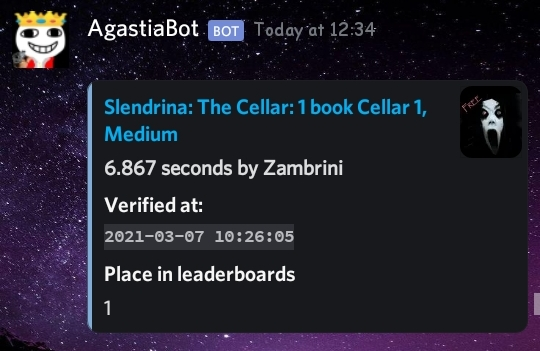

## RunGet Bot
RunGet is a discord bot that posts recent verified runs from Speedrun.com 
You can invite the official hosted version from [here](https://discord.com/api/oauth2/authorize?client_id=754827405813743676&permissions=52224&scope=bot)
<br>

## How to setup verified runs
1. Invite the bot to your server (or host it from source code)
2. Make sure bot has permission to send messages and embeds
3. Set the channel the bot will new runs in using /setchannel
4. add the game(s) you want to see its/their runs using /addgame or /addgames<br>
if you are in a server that the bot is in you could dm it and do step 4 directly!
## Commands
- /addgame: adds the mentioned game into the gamelist
- /addgames: same as /addgame but it can add multiple games when they're seperated by |
- /deletegame: deletes mentioned game from gamelist
- /deletegames: same as /deletegame but it can delete multiple games when they're seperated by |
- /gamelist: sends the current server's gamelist in embed(s)
- /help: sends a list of commands with their usage
- /setchannel: sets the channel the bot will send new runs in (if no channel was provided it'll be set to the current channel)
- /invite: sends the bot's invite
- /source: sends the link to this repository
## Hosting
First install Nodejs and Git
Then open your terminal and clone the repo
```bash
git clone https://github.com/NoobJsPerson/runget
```
Enter it
```bash
cd runget
```
Then run
```bash
npm install
```
After that's done rename .env.example to .env
```bash
mv .env.example .env
```
Edit the new .env file replacing **yourtokenhere** by your bot token and **yourbotsidhere** by your bot's id.<br>
Afterwards run the slash commands deploy script. (this only needs to be done once)
```bash
node deploy_commands.js
```
then you can run the bot
```bash
node index.js
```
## Notes
* when using /addgame command you should pass the id, the abbreviation or game name (case sensitive)
## Credits
Special thanks to:
- [slashinfty](https://github.com/slashinfty) The owner of the repository this bot is built on, check out an archived version of it [here](https://archive.softwareheritage.org/browse/origin/directory/?origin_url=https://github.com/slashinfty/run-get)
- daanolav#6416 for the idea of caching game name and cover for less requests 
- kyra#6348 for previously hosting the official version of the bot

If you have any suggestions feel free to make an issue ;)

